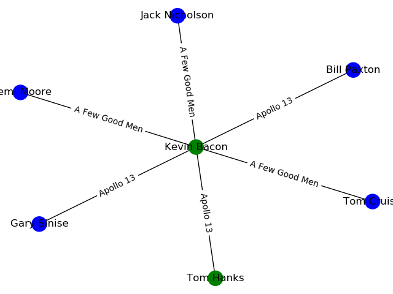

# Degrees

Write a program that determines how many “degrees of separation” apart two actors are.

```
$ python degrees.py large
Loading data...
Data loaded.
Name: Emma Watson
Name: Jennifer Lawrence
3 degrees of separation.
1: Emma Watson and Brendan Gleeson starred in Harry Potter and the Order of the Phoenix
2: Brendan Gleeson and Michael Fassbender starred in Trespass Against Us
3: Michael Fassbender and Jennifer Lawrence starred in X-Men: First Class
```

## Background

According to the Six Degrees of Kevin Bacon game, anyone in the Hollywood film industry can be connected to Kevin Bacon within six steps, where each step consists of finding a film that two actors both starred in.

In this problem, we’re interested in finding the shortest path between any two actors by choosing a sequence of movies that connects them. For example, the shortest path between Jennifer Lawrence and Tom Hanks is 2: Jennifer Lawrence is connected to Kevin Bacon by both starring in “X-Men: First Class,” and Kevin Bacon is connected to Tom Hanks by both starring in “Apollo 13.”

We can frame this as a search problem: our states are people. Our actions are movies, which take us from one actor to another (it’s true that a movie could take us to multiple different actors, but that’s okay for this problem). Our initial state and goal state are defined by the two people we’re trying to connect. By using breadth-first search, we can find the shortest path from one actor to another.

## Getting started

### Prerequisites

- python==3.7.4
- matplotlib==3.1.1
- networkx==2.4

Those are the versions used in the development, you can use others but no garantee it will works as expected

### Installation

Clone the repository and change to the current directory

```
git clone https://github.com/Diezaztek/CS50.git
cd degrees
```

Run the program using the terminal, if no argument is passed, large is taken by default

```
python degrees.py ["small"|"large"]
```

## Examples

```
$ python degrees.py small
Loading data...
Data loaded.
Name: kevin bacon
Name: tom hanks
Calculating...
1 degrees of separation.
1: Kevin Bacon and Tom Hanks starred in Apollo 13
```

Additionally to the console output, a file will be generated showing the search graph and the chosen path



**Note** You can change de size of the output graph by editing the util.py in line 58
```
plt.figure(figsize=(50,50))
```

The size will depends on how big are the graph you are analizing 